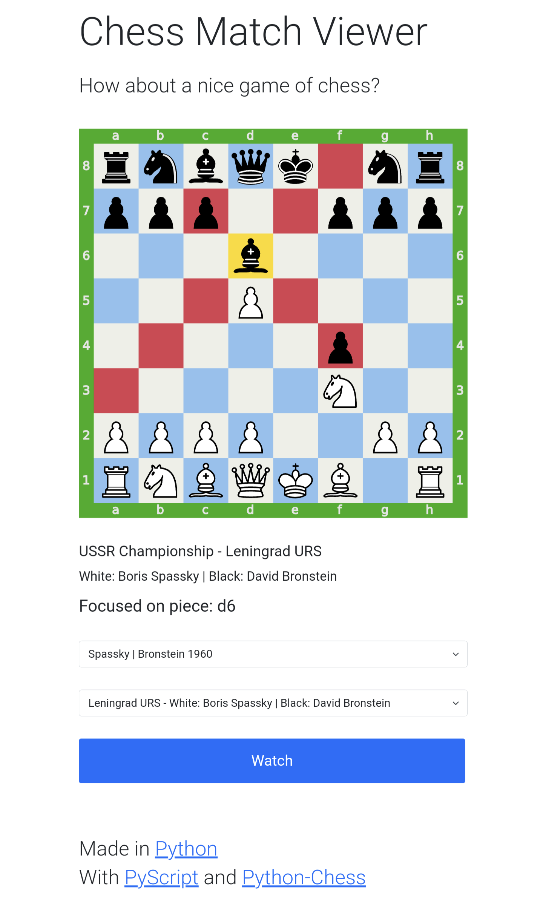

# ChessMatchViewer
View chess matches in your browser

## Usage

The viewer can be seen [here](https://about.nmstoker.com/chess2.html) where it is hosted on [Github Pages](https://pages.github.com/)

Since the pages are static, requiring nothing more than being served up to the user, they can be easily self-hosted in any of the usual ways.

If you want to serve them up locally then, it should be fine to run the following from the repo directly:

`python3 -m http.server`

- Point your browser at the main file, chess.html, give it a few moments to load
- Select the match (and game if the PGN file has more than one)
- Press Watch to start playback and Pause to pause it
- Tapping on pieces shows their attack lines

## About

The application is built using [PyScript](https://github.com/pyscript/pyscript), running Python in the browser, which in turn enables use of the marvellous [python-chess](https://github.com/niklasf/python-chess) package

## Roadmap

Not expecting to do anything major but will likely experiment with adding:

- [ ] Options to adjust speed of moves
- [ ] Loading games from online PGN files
- [ ] Offline PWA version

